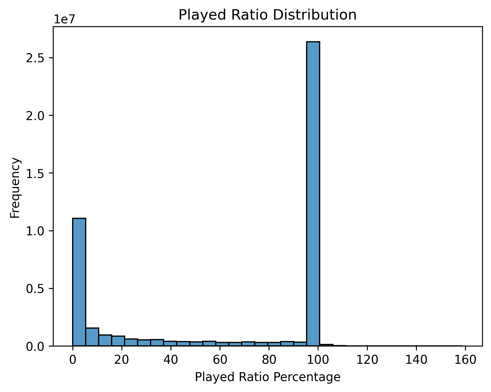
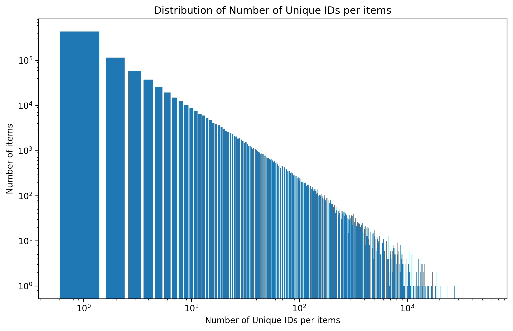
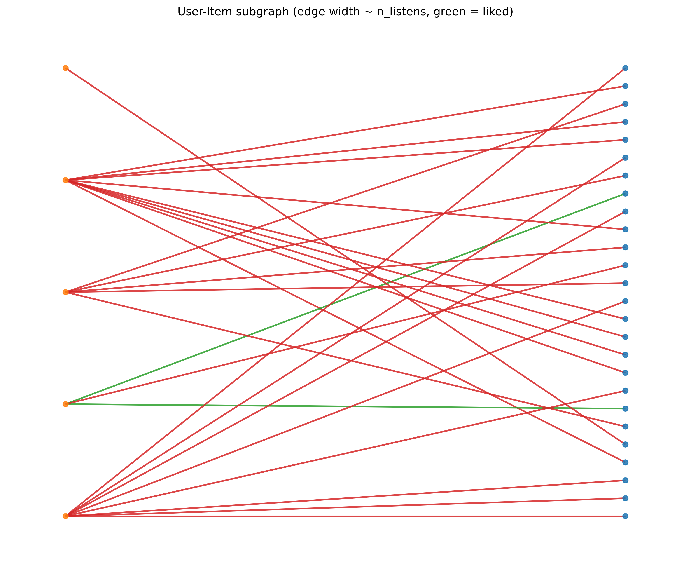

# GraphNN — Yambda Recommendation System

Repository for exploring Graph Neural Networks applied to the **Yambda** (Yandex Music) dataset and for prototyping recommender-system ideas on a realistic, industrial-scale dataset.

## About the dataset

Yambda (a.k.a. **Yambda-5B / YaMBDa**) is a very large, open dataset of user–track interactions released by Yandex. Key points:

* The full release contains **\~4.79 billion user–item interactions** (the “5B” release). 
* The data covers **≈1 million users** and **≈9.4 million tracks**. 
* The dataset is provided in several sizes to support different compute budgets: **50M**, **500M**, and the full **\~4.79B** events. 
* Yambda includes multiple interaction types (listens, likes, dislikes, unlikes, undislikes), **precomputed audio embeddings**, timestamps, and the important `is_organic` flag that identifies organic (user-initiated) vs. recommendation-driven actions — useful for separating natural behavior from recommender influence. 

## Exploratory Data Analysis

A short summary of the notebook contents:

* Basic statistics: unique users, unique items, total interactions (50M sample).
* `is_organic` analysis: breakdown of organic vs. recommendation-driven listens.
* Likes vs. dislikes counts and organic share.
* Item ⇄ user relationship analysis (per-item number of distinct users) with log–log visualization.
* `played_ratio_pct` distribution (how much of a track users played).
* Small bipartite graph visualization (user–item subgraph) to illustrate connectivity patterns.

Snapshots from the notebook:

**Played ratio distribution**

**Item–user relationship distribution**

**Sample user–item bipartite subgraph**

## Team

* Bulat Sharipov
* Danil Fathutdinov
* Dinar Yakupov

